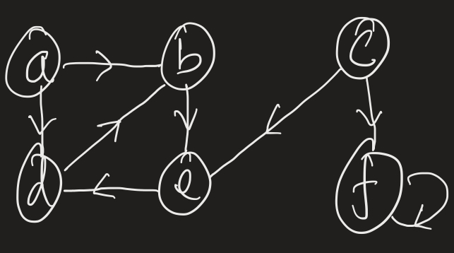
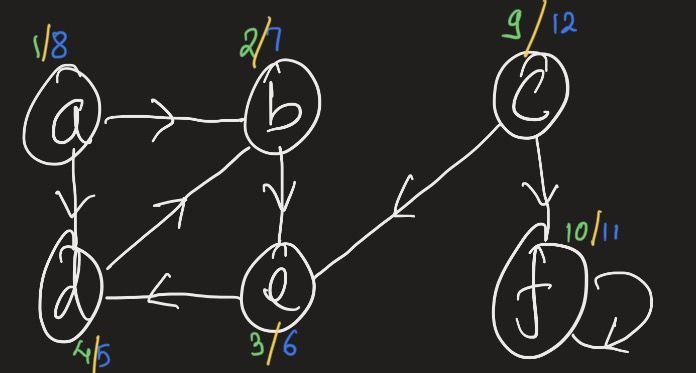
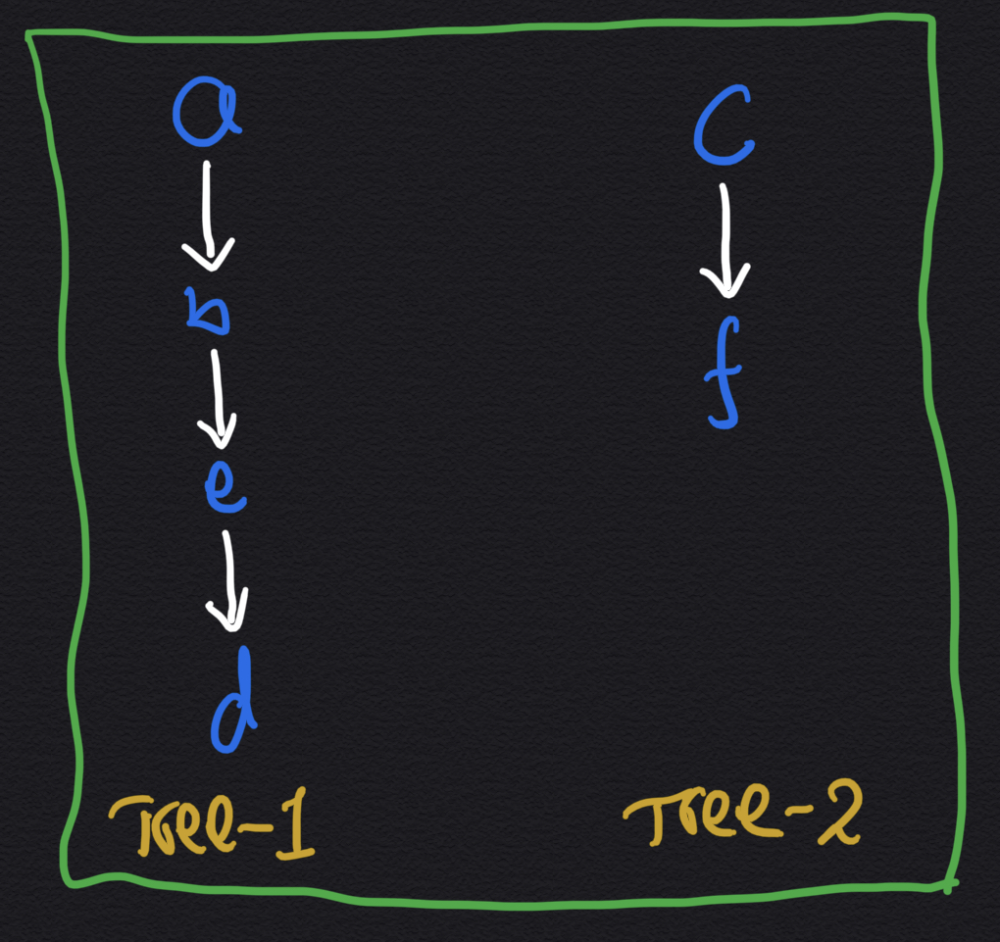
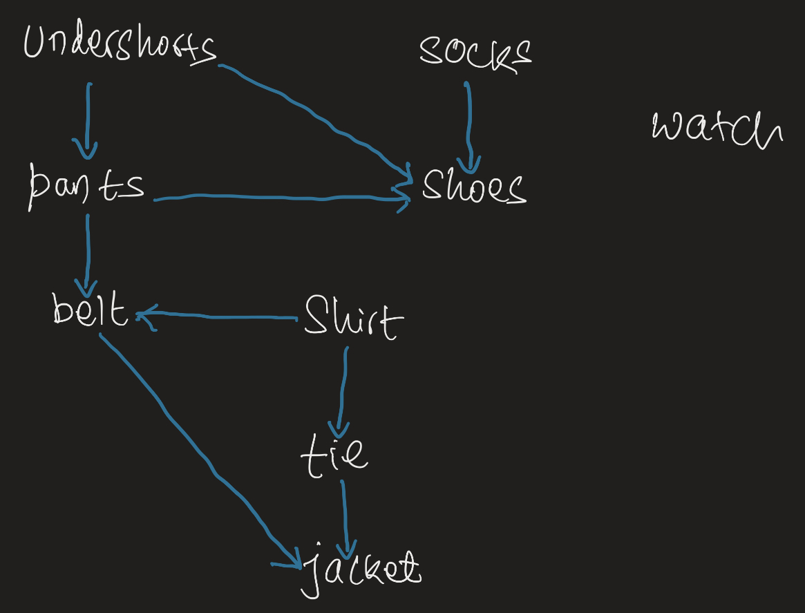
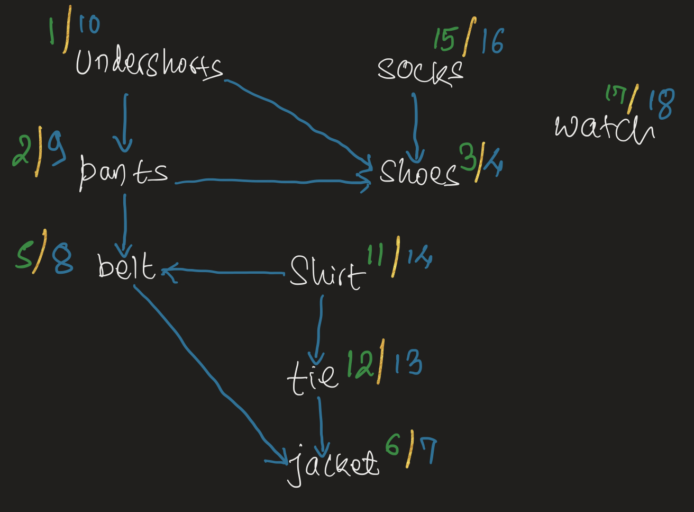
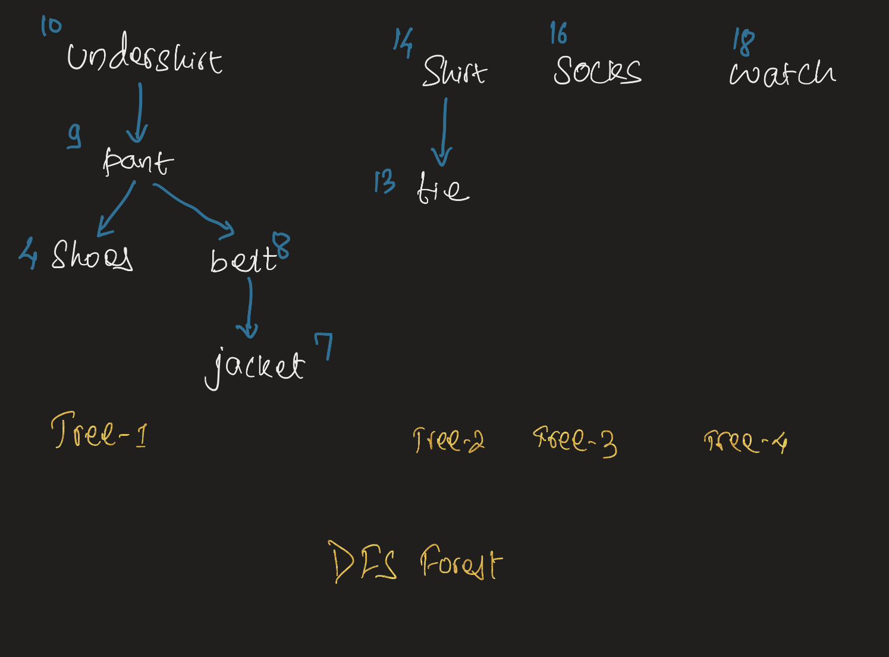

- [Depth First Search](#depth-first-search)
  - [Concept](#concept)
  - [Show me the code](#show-me-the-code)
  - [Edge Classification + forest counting](#edge-classification--forest-counting)
    - [Tree edges:](#tree-edges)
    - [Back edges:](#back-edges)
    - [Cross edges:](#cross-edges)
  - [Forest](#forest)
  - [Show me the code](#show-me-the-code-1)
  - [Runtime for DFS](#runtime-for-dfs)
- [Topological Sort: Application of DFS](#topological-sort-application-of-dfs)
  - [Concept:](#concept-1)
  - [Solution to the dressing problem](#solution-to-the-dressing-problem)
    - [Graph of DFS Forest](#graph-of-dfs-forest)
    - [Is there only one topological sort?](#is-there-only-one-topological-sort)
  - [Show me the code:](#show-me-the-code-2)
  - [Runtime](#runtime)


## Depth First Search

Suppose we want to traverse the graph 

### Concept

In depth first, for every node we ask "what's the next node I can go to from current node?". For every node that you can reach to from current node, you just keep following it.

> In breadth first search, we made list of nodes that can be reached from current node. Then we traversed each node in this new list; in depth first, you keep following a node walking through the edges until you can no longer find new vertex or there is no more edge.

Here is how we traverse the above graph:

1. Start at edge `a`.

   > `a.enter = 1`

   > From there I can reach `b` and `d`;

   - Run through `b` first (then d after b is done);

     > `b.enter = 2`

     - From b, you can reach `e`;

       > `e.enter = 3`

       - From e, reach `d`:

         > `d.enter = 4`

         > From d you can reach b but we already explored b. So d is done

         > `d.exit = 5`

       > `e.exit = 6`

     > `b.exit = 7`

   - Now we are back at a. From a explored b; next was d. But d just got explored too. So not needed to explore d any more. Therefore, everything that we can reach from a is now done and therefore exploring a is done too!

   > `a.exit = 8`

2. Next node is b which is already explored;
3. Next is c which is not yet explored. Let's explore this node

   > `c.enter = 9`

   > From c we can explore e & f. But e is already done. So just need to explore f!

   - Explore `f`:

     > `f.enter = 10`

     > From f you can only reach f which just got explored! Done exploring f

     > `f.exit = 11`

   > `c.exit = 12`

4. `d, e, f` are next edges which are now all explored! We are done with dfs

> For entry and exit, if you were to start parenthesis at entry and remove it at exit, you will have nice open and close parenthesis. You could almost follow the spacing in the above notes and build that open close parenthesis. In the graph below I have numbered the entry points with green color and exit with blue color.

> Notice the edge that we start with always ends in last. (Back to order of parenthesis, inner parenthesis must be closed first before closing outer parenthesis)

> Why is this numbering important? We will touch on it little below



### Show me the code

> In the code `gateKeeper` function keeps track of entry and exit.

[2_dfs.py](./2_dfs.py)

### Edge Classification + forest counting

During DFS, you an do edge classification. Edges can be classified as: `Tree Edges`, `Back Edges`, `Forward Edges` and `Cross Edges`

#### Tree edges:

- The parent edge that leads to new edges which has not been explored yet

#### Back edges:

- The edges that leads to parent; self-loops, like f, are called back edges

#### Cross edges:

- connects different BFS forest

Let's keep track of nodes to make edge classification. Here is how we know the edges will be traveresed in DFS: `a, b, e, d, c, f`;

- FOREST = 1

  - `a.exploring = True`

    > `a->b`: TREE

    > because a is marked as exploring but b does not have any note; so b must have been seen for the first time

    - `b.exploring = True`

      > `b->e`: TREE

      - `e.exploring = True`

        > `e->d`: TREE

        - `d.exploring = True`

          > `d->b`: BACK

          > becase both are being explored. Child lead to parent!

        - `d.exploring = False`

      - `e.exploring = False`

    - `b.exploring = False`

    > `a->d`: FORWARD

    > a is being explored but d is done exploring still as a part of same forest

  - `a.exploring = False`

- Everything reachable from A has now been explored; So FOREST = 2

  - `c.exploring = True`

    > `c->e`: CROSS

    > because c is being explored and it led to the edge which has been explored of different forest

    > `c->f`: TREE

    - `f.exploring = True`

      > `f->f`: BACK
      > because both edges, f & f are being explored

    - `f.exploring = False`

  - `c.exploring = False`

  - Going forward, all vertices have been explored and we are done!
  - Just completed all Edge classification too!

### Forest

In the above code we have last count of forest set to 2. But what is a forest? To see what a forest is, let's look at the diagram below:



When we ran through DFS for our graph, we got path `a -> b -> e -> d`; With that we reached everything that we can reach from a; After that new path was built starting from node c and got path `c -> d`. These two path are two distinct trees, `Tree-1` and `Tree-2` that was generated from our DFS. All these trees makes a DFS forest. If you had more complicated grah, it is possible that the tree will actually branch out and have edges other then the linear path that we see here.

> `Tree` is a connected graph that is acyclic


### Show me the code

[2_dfs_edges.py](./2_dfs_edges.py)

### Runtime for DFS

- Same as BFS because we need to walk through every vertices and then for each adjaceny list (edges of vertex)

```
   O(V + E)
```


## Topological Sort: Application of DFS

> Applies only to Directed Acyclic Graph
> In DFS if you detect back edge at any time then, it means the graph is cyclic and therefore topolical sort cannot be done

### Concept:



Lets consider this dressing problem. In order to dress up, first you have to wear undershorts and then only you can wear pants; After that you can wear shoes but before you wear shoes you must wear socks and then only shoes. The graph edges represents if there is any precursor. Watch finally is the special case where it has no edges coming to it. What that means is you can do watch step at any time during the execution

Based on this graph, can we write the order that we can do things in so that everything gets done in proper order.

### Solution to the dressing problem

We can represent this graph as:

```python
graph = {
  'undershirt': ['pants', 'shoes'],
  'pants': ['shoes', 'belt'],
  'belt': ['jacket'],
  'shirt': ['tie', 'belt'],
  'tie': ['jacket'],
  'jacket': [],
  'socks': ['shoes'],
  'shoes': [],
  'watch': [],
}
```

Now we can run DFS on this one and the end result of entry and exit timer from gateKeeper is:



Lines in green is entry time and blue is exit time. If you write the items in the descending order of exit time, you will topologically sorted items. The order to do things for this graph based on exit time is:


`watch -> socks -> shirt -> tie -> undershirt -> pants -> belt -> jacket -> shoes`

If you read through these, you will realize you can dress in that order!

#### Graph of DFS Forest



Did you notice that in this DFS Forest, first 4th tree is done; then 3rd tree, then 2nd tree and finally last tree.

#### Is there only one topological sort?

Is this is the only topological sort?

`watch -> socks -> shirt -> tie -> undershirt -> pants -> belt -> jacket -> shoes`

If we were to re-order some of the items in adjacency list you will get completely different sorting order. Here is the graph representation:

```python
graph = {
    'shirt': ['tie', 'belt'],
    'watch': [],
    'undershirt': ['pants', 'shoes'],
    'socks': ['shoes'],
    'pants': ['shoes', 'belt'],
    'belt': ['jacket'],
    'tie': ['jacket'],
    'jacket': [],
    'shoes': [],
}
```

The sorting order would be:

`socks -> undershirt -> pants -> shoes -> watch -> shirt -> belt -> tie -> jacket`

If you run through this order, you can dress up in this order too! So it is completely possible to do things in this order.

### Show me the code:

[2_dfs_topo.py](./2_dfs_topo.py)

> The code that we saw for DFS Edge Classification + Forest counting, I just updated it to keep a list of items based on exit order. And we have topological sort done!

### Runtime

> Same as DFS