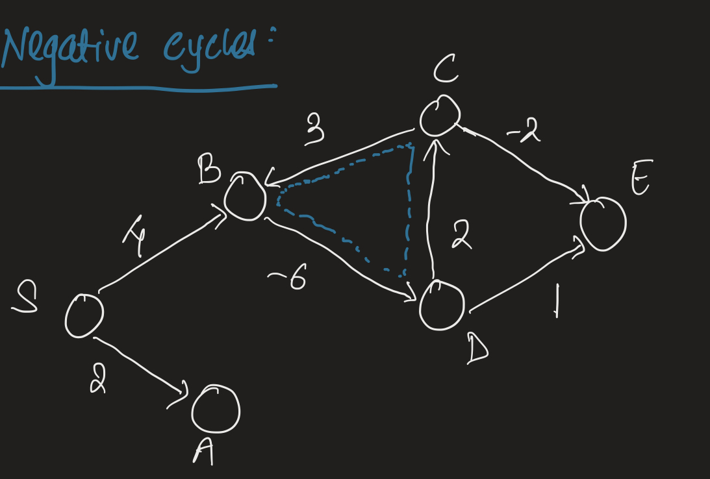
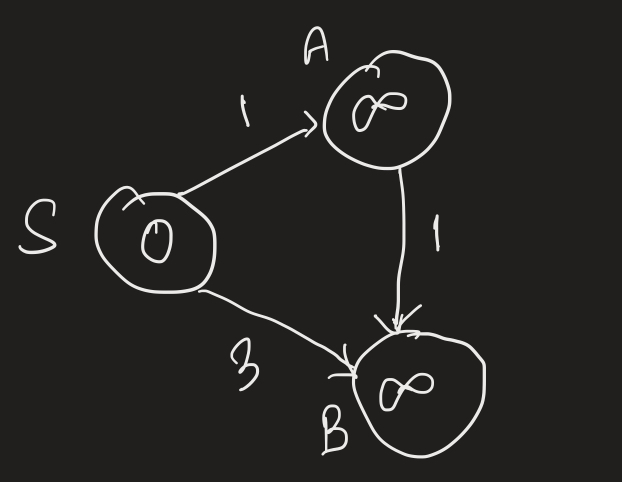
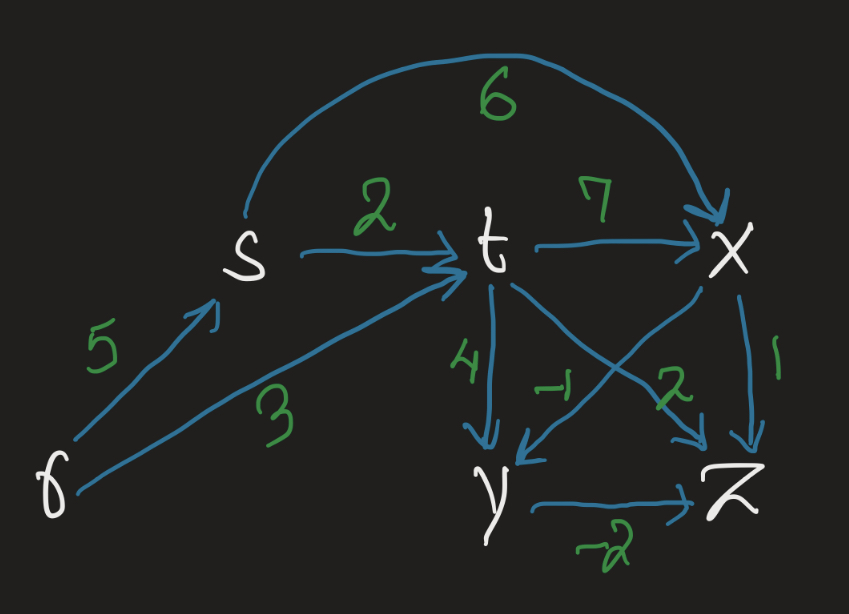
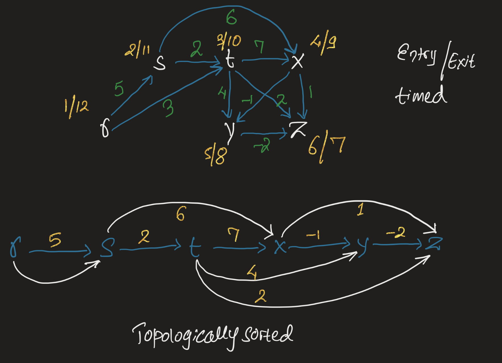
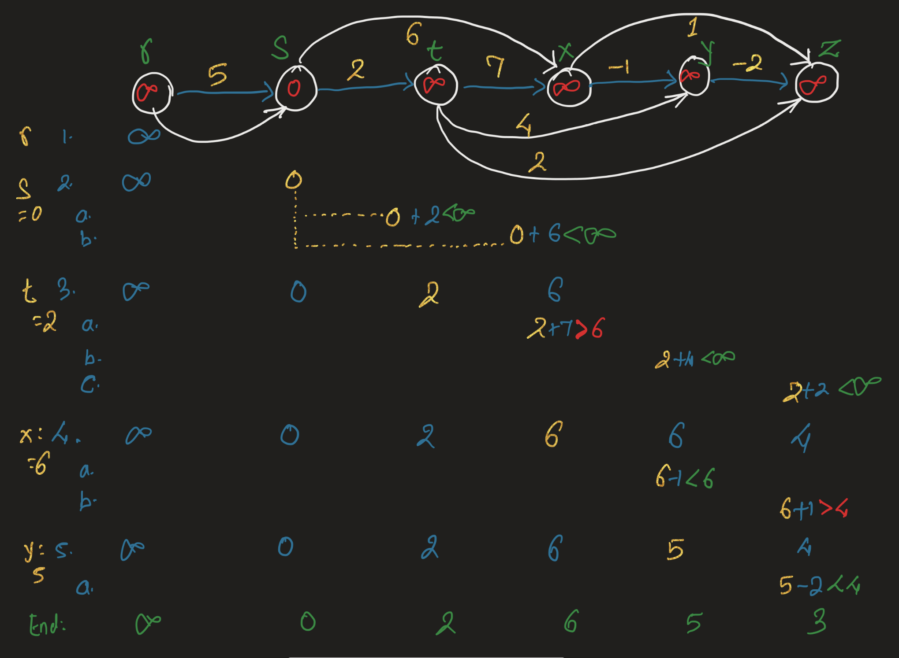
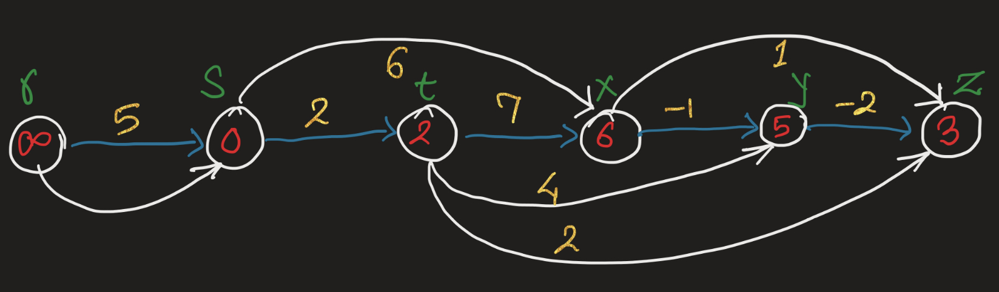

- [Single Source Shortes Path Problem](#single-source-shortes-path-problem)
  - [Concept](#concept)
    - [Shortest Paths Problem](#shortest-paths-problem)
    - [Weight of Path](#weight-of-path)
  - [Values of weight](#values-of-weight)
    - [Negative Cycles](#negative-cycles)
  - [Relaxing edge:](#relaxing-edge)
  - [Single source shortest path for Directed Ayclic Graph [DAG]](#single-source-shortest-path-for-directed-ayclic-graph-dag)
    - [Concept](#concept-1)
      - [Graph Representation in code](#graph-representation-in-code)
    - [Pseudocode Step 1: Topological sorting](#pseudocode-step-1-topological-sorting)
    - [Pseudocode Step 2: Initialize single source 's'](#pseudocode-step-2-initialize-single-source-s)
    - [Pseudocode Step 3: Pass over and relax](#pseudocode-step-3-pass-over-and-relax)
    - [Result](#result)
    - [Show me the code](#show-me-the-code)
- [Applications of Shortest Path Algorithm](#applications-of-shortest-path-algorithm)

## Single Source Shortes Path Problem

### Concept

#### Shortest Paths Problem
For shortest path problem we will work with `Weighted Directed Graph G(V, E)` with weight function `w : E -> R` 

#### Weight of Path
Sum of the weight of the edges 


### Values of weight
Weight is just some number. For eg in case of finding best route between two cities, weights will be distances between cities. In this example weight is a positive number. However, weights can be negative number too. Negative number is not a problem but `negative cycles are problem`. Here is an example:

#### Negative Cycles



In this graph, you can go from `S -> B` and the `weight` of the path is `4`. 

Now right around B, there is negative cycle. The path from `B -> D -> C -> B` is `-6 + 2 + 3` = `-1` is a negative value and becomes a negative cycle. If you around this path 2 times, `B -> D -> C -> B -> D -> C -> B`, you will get `-2`. 3 time will be -3 and so on. 

Now if we go from `S -> B -> D -> C -> B` you have combined path from `S -> B`, which is 4, plus 1 negative cycle resulting in the weight of `3`. If you combine two negative cycle you will have path of `4 - 2 = 2`. If you keep adding negative cycle, you will keep reducing the weight of the path `S -> B`. This is `potentially problematic` because it will lead you into infinite loop.


### Relaxing edge:

> This concept comes up in the implementation of the shortest path algorithms. So, lets talk about this before diving into code



The vertex s represents source for the shortest path, meaning this is your starting vertex and from this vertex you want to go to different vertex if it can reach there.

- Intially since s is the starting edge we put value of 0 for this edge. For all other edges we start with value of Infinity. 

Let's relax the edges going out of s:
- A: The weight of `s -> A`. We represent this as `d[A] = 1` and set A's predecessor to be S as: `π[A] = s`. 
- B: Similarly `d[B] = 3` and  `π[B] = s`

However, in this simpler graph we can see that if we were to go to B as: `s -> A -> B` then the weight of this path is 2, less then current value of `d[B]` which is 3 at the moment. This meant we can relax B again. Relax B as: `d[B] = 2` and `π[B] = A`

> `Relaxing an edge` means checking to see if we have better value for `d[u]`, where u is a vertex that belongs to V. After that we update `predecessor relationship` represented by `π[u]`


### Single source shortest path for Directed Ayclic Graph [DAG]

> Going forward I will abbreviate shortest path with SP. Also remember anytime we are talking about SP, we always means single source SP.

- In [depth first search](../readme.md), we looked at toplogical sort. In order to implement SP for DAG that is where we will start

Nice thing about DAGs is that they do not have cycles. This is the definition of DAG. Here is how to implement SP for DAG:

#### Concept

Here is `pseudocode` of how we will implement this code:

1. Topologically sort the graph
2. Initalize single source
   - For edge that occurs before the source set `d = infinity` & `pi = null`. These edges that occurs before can never be reached from the source and the value will stay inifinity
   - For edge that is source, set `d = 0` and `pi = null`. d is 0 here because the path from source to itself is 0 (no need to go anywhere) 
   - For other edges that occurs after the source set `d = infinity` and `pi = null`
3. Do one pass over the vertices in topologically sorted order relaxing each edge that leaves each vertex.


Suppose we want to compute `shortest path from` the vertex `s` `to any other edge` in the following DAG:



##### Graph Representation in code

In our earlier example we used adjacency list to represent graph in code. We will make use of adjacency list too but this time we need to consider the weights too. During the toplogical sort, weights won't have any impact but during relaxation step we will use it

> Because the language supports iteration over collection be it list or dictionary the same way here vertex points to dictionary where the keys are another vertices and the value is weight of the edge


```python
graph = {
    'r': {'s': 5, 't': 3},
    's': {'t': 2, 'x': 6},
    't': {'x': 7, 'y': 4, 'z': 2},
    'x': {'y': -1, 'z': 1},
    'y': {'z': -2},
    'z': {}
}
```


#### Pseudocode Step 1: Topological sorting

In [depth first search](../readme.md) we touched upon entry/exit time and using it for topological sorting. Here is what that result looks like:



> `code:` call to function `dfs` returns topologically sorted items

#### Pseudocode Step 2: Initialize single source 's'
In our case we want to compute shortest path from the edge s to rest of vertices. So only for the vertex `s` set `d = 0` & `pi = null`. For the rest we initialize `d = infinity` and `pi = null`

The result of init is filled in the digram below. Only s has value of 0 and rest are set to infinity.

> `code:` we call `init` function which does this initalization for us. It returns a function that knows how to relax



#### Pseudocode Step 3: Pass over and relax

Here we go over each topologically sorted vertex. For each vertex you iterate over the vertices it can reach.

1. First vertex `r` and it can reach `s`:
   > see above diagram step 1
   - weight for node r, `d[r]` = infinity (from init step)
   - weight of `r -> s` is 5
   - add: infinity + 5 = infinity `possible new value`
   - infinity is not less then 0 (d[s]) & therefore no relaxation
   > we return this value of infinity which is used to skip iteration of rest of the edges r can reach to. This works because r comes before s and the value will always be infinity

2. Second vertex is `s` and it can reach `t` and `x`
   > see step 2 in diagram
   - `d[s] = 0` (from init step)
   - a. vertex `t`
     - `s -> t` weighs 2
     - add: 0 + 2 = 2 `possible new value`
     - this new value 2 is less the current value d[t] which is inifinity
     - relax the edge `s -> t` by setting d[t] = 2 & pi[t] = s
   - b. vertex `x`
     - `s -> x` weights 6
     - add: 0 + 6 = 6 `possible new value`
     - this new value 6 is less the current value d[x] which is inifinity
     - relax the edge `s -> x` by setting d[x] = 6 & pi[x] = s


We go through every node and repeat similar steps for relaxation. Finally we get relaxed values as:




> `code:` In the code this pseudo code is represented by `sp` function


#### Result

Here is what the `sp` function returns:

```python
{'r': {'d': inf, 'pi': None}, 's': {'d': 0, 'pi': None}, 't': {'d': 2, 'pi': 's'}, 'x': {'d': 6, 'pi': 's'}, 'y': {'d': 5, 'pi': 'x'}, 'z': {'d': 3, 'pi': 'y'}}
```

By following the pi of each vertex you will reach the source s through the shortest path. The length of path is stored by the d value for every node. Here is an example of shortest path form s to z: `s -> x -> y -> z` and the length of this path is 3

> `code:` the function `getSPlog` prints the exact path and distance from above json


#### Show me the code

[dag](./1_dag.py)

## Applications of Shortest Path Algorithm

- Google maps finds path from point A to Point B
- If you are delivery company like Fedex or USPS or DHL. Then you have many packages to deliver. How do you find best route for delivery of packages?