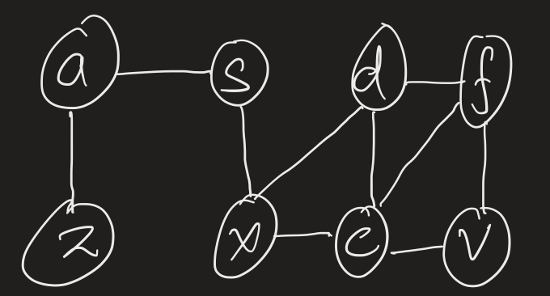
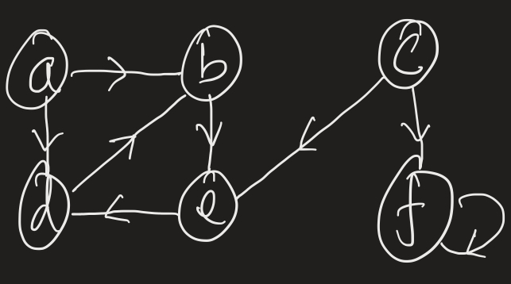
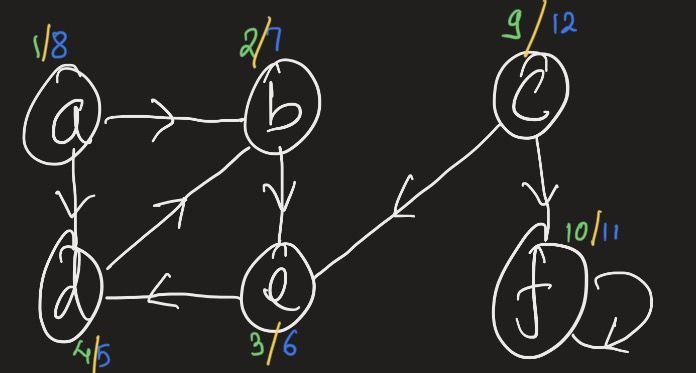

# Learning algorithms!

## Breadth First Search

Suppose we want to traverse the graph 

### Concept:

1. Suppose we start at the vertex `s`; `(level = 0; parent = none)`
2. Next question to ask is what are the `vertices` that I can reach from S? The answer is `a & x`. Assign them `level = 1 & parent = s`
3. For each of these vertices ask, what are the `vertices` I can reach from each of them? The answer for a is `s & z`; Answer for x is `s, d & c`. From a if you go to s, you are back to step 1 and will be stuck in this cycle forever. So, out of all these vertices that we just found, we only one to pick the ones that we have not seen before, aka only new vertices. So, in this step the list of new vertices we come up with are: `z, d, c`; `level = 2`; `parent for z = a; parent for d & c = x`.
4. Finally from d & c the new vertices are `f & v`. `Level = 3; parent for f = d; parent for v = c`
5. f & v will not result in new nodes and therefore we are done!

### Shortest path: What's the shortest path from f to s?

Well in above steps, we kept track of parent. If you follow the parent pointer from above step, you will reach the node s.

Essentially, you should traverse the graph using BFS approach starting with the node S. Then follow the parent pointers. This will lead you to shortest path. The level value for f tells exactly how many steps is needed to go from f to s!

### Representing graphs in code:

You can use the adjacency dict that we have used below for the graph representation. (Instead of dict, you can use list too!). For every vertex, you will store the items that it is connected to.

```py
graph = {
    'a': ['s', 'z'],
    's': ['a', 'x'],
    'd': ['f', 'x', 'c'],
    'f': ['d', 'c', 'v'],
    'z': ['a'],
    'x': ['s', 'd', 'c'],
    'c': ['d', 'f', 'x', 'v'],
    'v': ['f', 'c']
}
```

### Show me the code:

[1_bfs.py](./1_bfs.py)

### Tell me more:

https://www.youtube.com/watch?v=s-CYnVz-uh4

## Depth First Search

Suppose we want to traverse the graph 

### Concept:

In depth first, for every node we ask "what's the next node I can go to from current node?". For every node that you can reach to from current node, you just keep following it.

> In breadth first search, we made list of nodes that can be reached from current node. Then we traversed each node in this new list; in depth first, you keep following a node walking through the edges until you can no longer find new vertex or there is no more edge.

Here is how we traverse the above graph:

1. Start at edge `a`.

   > `a.enter = 1`

   > From there I can reach `b` and `d`;

   - Run through `b` first (then d after b is done);

     > `b.enter = 2`

     - From b, you can reach `e`;

       > `e.enter = 3`

       - From e, reach `d`:

         > `d.enter = 4`

         > From d you can reach b but we already explored b. So d is done

         > `d.exit = 5`

       > `e.exit = 6`

     > `b.exit = 7`

   - Now we are back at a. From a explored b; next was d. But d just got explored too. So not needed to explore d any more. Therefore, everything that we can reach from a is now done and therefore exploring a is done too!

   > `a.exit = 8`

2. Next node is b which is already explored;
3. Next is c which is not yet explored. Let's explore this node

   > `c.enter = 9`

   > From c we can explore e & f. But e is already done. So just need to explore f!

   - Explore `f`:

     > `f.enter = 10`

     > From f you can only reach f which just got explored! Done exploring f

     > `f.exit = 11`

   > `c.exit = 12`

4. `d, e, f` are next edges which are now all explored! We are done with dfs

> For entry and exit, if you were to start parenthesis at entry and remove it at exit, you will have nice open and close parenthesis. You could almost follow the spacing in the above notes and build that open close parenthesis. In the graph below I have numbered the entry points with green color and exit with blue color.

> Notice the edge that we start with always ends in last. (Back to order of parenthesis, inner parenthesis must be closed first before closing outer parenthesis)

> Why is this numbering important? We will touch on it little below



### Show me the code:

> In the code `gateKeeper` function keeps track of entry and exit.

[2_dfs.py](./2_dfs.py)

### Edge Classification + forest counting:

During DFS, you an do edge classification. Edges can be classified as: `Tree Edges`, `Back Edges`, `Forward Edges` and `Cross Edges`

#### Tree edges:

- The parent edge that leads to new edges which has not been explored yet

#### Back edges:

- The edges that leads to parent; self-loops, like f, are called back edges

#### Cross edges:

- connects different BFS forest

Let's keep track of nodes to make edge classification. Here is how we know the edges will be traveresed in DFS: `a, b, e, d, c, f`;

- FOREST = 1

  - `a.exploring = True`

    > `a->b`: TREE

    > because a is marked as exploring but b does not have any note; so b must have been seen for the first time

    - `b.exploring = True`

      > `b->e`: TREE

      - `e.exploring = True`

        > `e->d`: TREE

        - `d.exploring = True`

          > `d->b`: BACK

          > becase both are being explored. Child lead to parent!

        - `d.exploring = False`

      - `e.exploring = False`

    - `b.exploring = False`

    > `a->d`: FORWARD

    > a is being explored but d is done exploring still as a part of same forest

  - `a.exploring = False`

- Everything reachable from A has now been explored; So FOREST = 2

  - `c.exploring = True`

    > `c->e`: CROSS

    > because c is being explored and it led to the edge which has been explored of different forest

    > `c->f`: TREE

    - `f.exploring = True`

      > `f->f`: BACK
      > because both edges, f & f are being explored

    - `f.exploring = False`

  - `c.exploring = False`

  - Going forward, all vertices have been explored and we are done!
  - Just completed all Edge classification too!

### Forest:

??

### Show me the code:

[2_dfs_edges.py](./2_dfs_edges.py)

### Runtime for DFS
